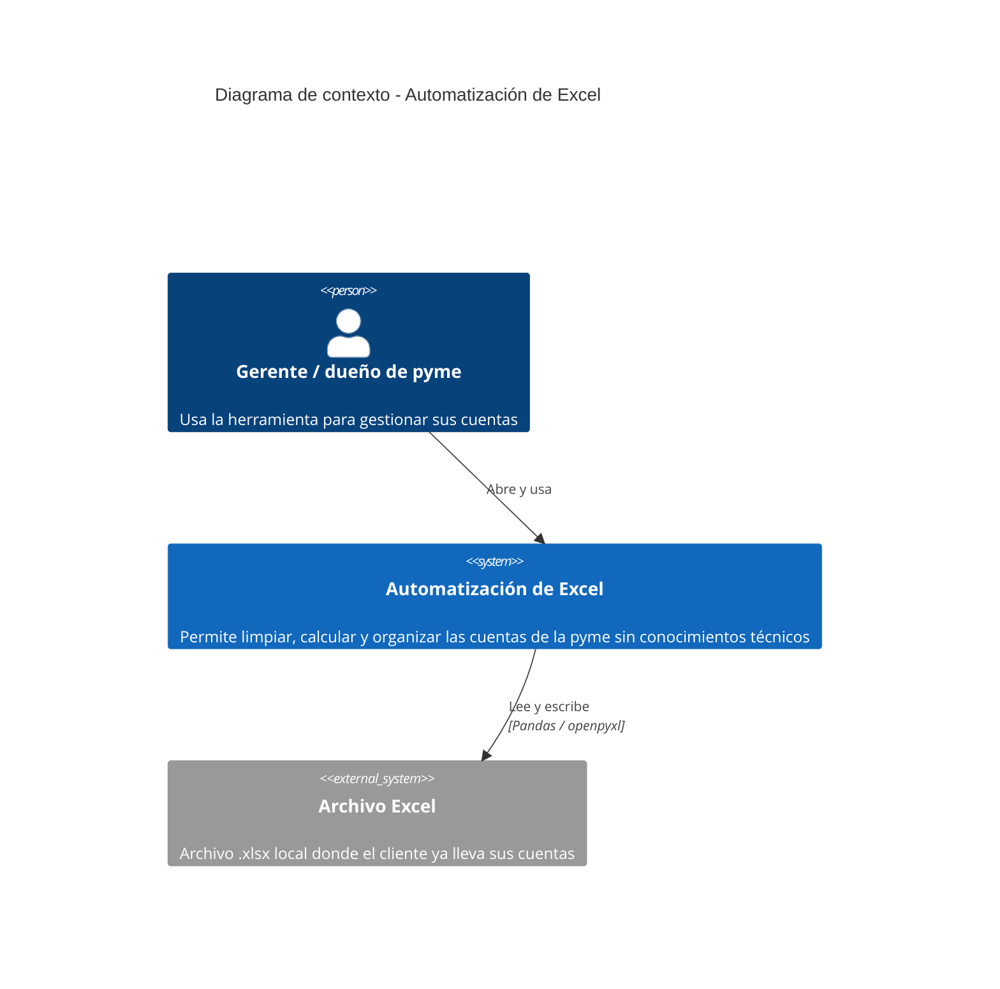
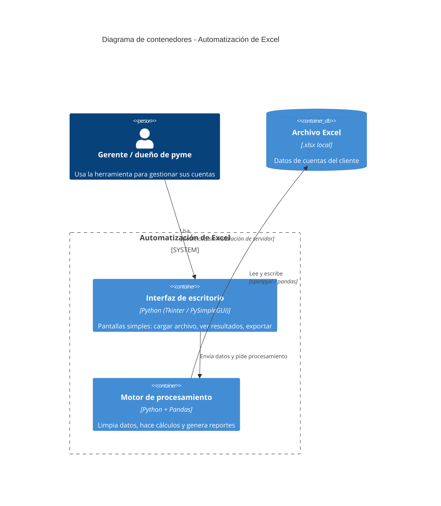

# Diagrama C4 — Automatización de Excel para pymes

Arquitectura propuesta: app de escritorio local en Python (empaquetada como
`.exe` con PyInstaller), sin servidor ni conexión a internet, que lee y
escribe directamente sobre el archivo Excel del cliente.

## Nivel 1 — Contexto

## Nivel 2 — Contenedores

## Notas

- Sin servidor ni base de datos: todo corre en la máquina del cliente, sobre
  su propio archivo Excel. Esto simplifica mucho la puesta en marcha.
- Si más adelante agregas reportes en la nube, backups automáticos, o
  múltiples usuarios, ahí aparecería un nuevo contenedor (API/backend) y
  probablemente una base de datos — momento en el que conviene ampliar este
  diagrama.
- Si preferís PlantUML en vez de Mermaid (por ejemplo si tu editor no
  renderiza Mermaid), decime y te paso la versión equivalente con
  C4-PlantUML.
